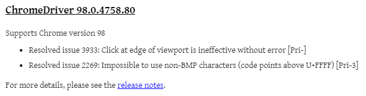
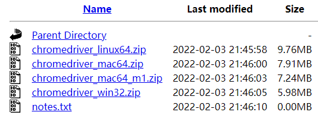
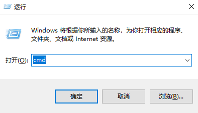
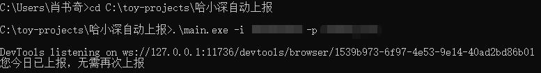

# 哈小深自动上报

基于python3, selenium, chromedriver

## 上报内容

目前该程序基本自用，内容固定，有待后续更新

- 当前状态：其他

- 目前本人新冠疫苗接种情况：已接种全部剂次

## 使用方法 (Windows)

1. 您的电脑上需要有 Chrome 浏览器

2. 请查看您的 Chrome 版本（浏览器右上角->帮助->关于 Google Chrome）

   

3. 访问 [ChromeDriver 主页](https://chromedriver.chromium.org/downloads)，根据您的 Chrome 版本号点击相应版本

   

   选择`_win32.zip`

   

4. 将解压后的文件与`main.exe`[[Github下载链接]](https://github.com/xiaosq2000/HITSZ-Self-Monitor/releases/download/v1.0/main.exe)[[蓝奏云下载链接(密码2efq)]](https://wwp.lanzouq.com/iORLX002r34h)，放入同一个文件夹中

5. `Win+R`，并输入cmd，点击确定

   

6.  依次输入两条指令即可

```powershell
cd 文件夹路径
.\main.exe -i 您的学号 -p 您的密码
```



## 每日定时执行 (Windows)

1. 将`.\main.exe -i 您的学号 -p 您的密码`写入`bat`格式文件中，并置于相应文件夹

2. 后续可参照教程[Windows 通过计划任务定时执行 bat 文件](https://blog.csdn.net/qq1049/article/details/78676504)